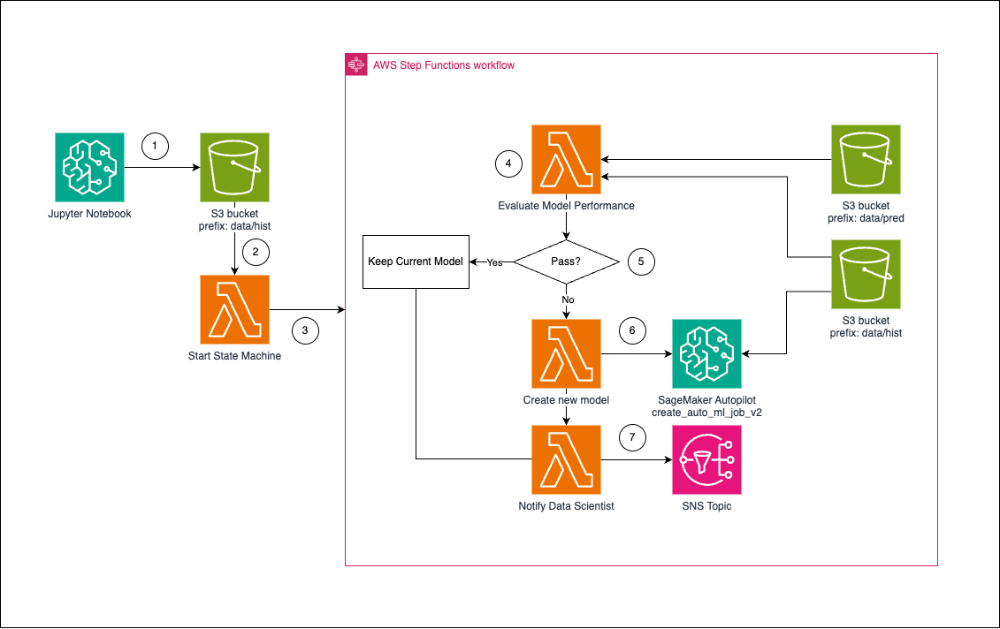

# Automated Time-series Performance Monitoring and Retraining using Amazon SageMaker Autopilot

This repository includes a [AWS Cloud Development Kit](https://github.com/aws/aws-cdk) template for quickly building the pipeline

---

## Introduction

This solution introduces an automated solution for monitoring and evaluating the performance of time-series models, and creating new model using Amazon SageMaker Autopilot, specifically tailored for applications like day-ahead power forecasting for solar panels. Given the critical reliance on accurate forecasts in such applications, maintaining model performance is important.Currently, there are significant challenges as the existing Amazon SageMaker Model Monitor do not support time-series data monitoring. This solution intends to address this gap by automating the continuous evaluation of model outputs against daily ground truth data, identifying performance degradation swiftly. 

When a model's performance drops below predefined thresholds, this pipeline automatically initiates Autopilot training processes to ensure predictions remain reliable and robust with new model. This not only **enhances the trust in model outputs** but also **significantly reduces the manual effort required from data scientists and business owners**. Following retraining, the system sends notifications to data scientists, allowing them to review and decide whether to deploy the updated model or continue with the existing one. 


### Upcoming feature
- Replacing AWS Step Function with Amazon SageMaker Pipeline
- Include inference job in the pipeline
- Support more objective metrics

### Disclaimer
- Simplified the new model evaluation by directly using the object metric value from Autopilot job
- Only use RMSE as example metric for evaluation and training. If you want to use other metric, replace this code block in [evaluation function](lambda_functions/perform_evaluation/app.py)
   
---

## Table of Contents
1. [Architecture](#Architecture)
2. [Resources](#Resources)
3. [Deployment](#Deployment)
4. [License](#License)

## Architecture <a name="Architecture"></a>



1. Generate synthetic dataset in jupyter notebook and upload data to S3 bucket
2. S3 `object create` event triggers Lambda function 
3. The Lambda function processes the event and start state machine
4. Download ground truth from `s3://<your-bucket>/data/hist` and predicted result from `s3://<your-bucket>/data/pred`, calculate the RMSE of a certain day's prediction, and share the result
5. If perform well comparing with threshold, keep the current model and end the workflow, otherwise start to train new model
6. Start new Autopilot job vis calling [`create_auto_ml_job_v2`](https://boto3.amazonaws.com/v1/documentation/api/latest/reference/services/sagemaker/client/create_auto_ml_job_v2.html)
7. Share the Autopilot job result and current model performance to data scientist for further investigation

## Resources <a name="Resources"></a>
 This is a list of the majority of the AWS services used in this project: 

| AWS Services | Usage | Comment |
|--------------|-------|---------|
| [Amazon S3](https://aws.amazon.com/s3/) | Store all data and models |
| [AWS Step Function](https://aws.amazon.com/step-functions/) | Orchestrate the steps from performance evaluation to send notification to data scientist for model review | You could achieve the same function using Amazon SageMaker Pipeline
| [Amazon SageMaker Autopilot](https://docs.aws.amazon.com/sagemaker/latest/dg/autopilot-automate-model-development.html) | AutoML to generate new time-series model |
| [AWS Lambda](https://aws.amazon.com/lambda/) | Calculate the metrics and execute steps in workflow |
| [AWS System Manager Parameter Store](https://docs.aws.amazon.com/systems-manager/latest/userguide/systems-manager-parameter-store.html) | Store model performance threshold | You could use Amazon DynamoDB to log all historical evaluation result


## Deployment <a name="Deployment"></a>

### 1. Deploy CDK Stack to build the infrastructure
Replace `aaaa@bbbb.com` with your email address to receive the notifcation of model performance

```
$ cdk deploy -c email=aaaa@bbbb.com
```

Once the deployment of SNS completed, you should receive a email notification. Please click __Confirm subscription__ for further notification.


### 2. Generate synthetic data to start the performance evaluation workflow

Execute the [solar-power-synthetic-data-generation](./solar-power-synthetic-data-generation.ipynb) notebook

You can find a running state machine in AWS Step Function Console once all cells ran:


Another email will be sent to your email address once the state machine completed. You can decide wheather to promote the new model or keep the current one after reviwing.


### Cleanup

First, empty the S3 bucket.

To dispose of the stack afterwards, run the command:

```
$ cdk destroy
```


## Useful commands

 * `cdk ls`          list all stacks in the app
 * `cdk synth`       emits the synthesized CloudFormation template
 * `cdk deploy`      deploy this stack to your default AWS account/region
 * `cdk diff`        compare deployed stack with current state
 * `cdk docs`        open CDK documentation

Enjoy!


## Security

See [CONTRIBUTING](CONTRIBUTING.md#security-issue-notifications) for more information.

## License

This library is licensed under the MIT-0 License. See the LICENSE file.